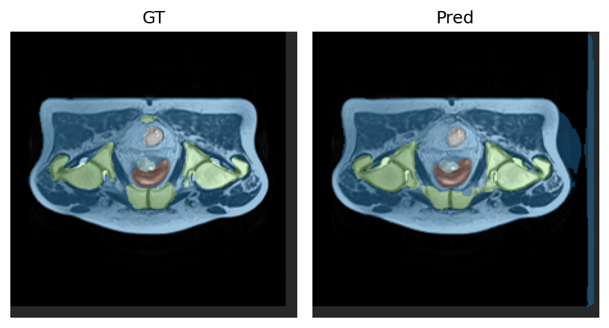

# Improved Unet for Segmenting the Prostate 3D Dataset 
The problem at hand is the segmenentation of 3D prostate MRI volumes into multiple anatomical structures. This is considered a multi class segmentation problem. The algorithm utilises an improved Unet model. Training was performed on Google Colab using A100 GPUs. The pipeline consists of four compenents: Dataloader, Model, Training, Prediction. The dependencies and versions required are listed below, run in Google Colab:

- Python 3.12.12
- PyTorch 2.8.0 (CUDA 12.6)
- nibabel 5.3.2
- scipy 1.16.3
- numpy 2.0.2
- matplotlib 3.10.0

## Dataloader 
Data is loaded from the 3D prostate dataset. To train on Google Colab, the dataset must be uploaded onto Google Drive and the disk mounted onto the Colab notebook. The data is divided into the standard 70:15:15 training validation and testing split. Some preprocessing is applied to the data. It is resampled and normalised to enhance reliability and reduce bias. The dataloader will output the file counts in a table like this:
```text 
==== Dataset file counts ====
Train files: 140
Val files:   48
Test files:  23
Total files: 211
```

## Model 
- Residual blocks for better gradient flow and network stability 
- GroupNorm 
- SCSE attention 
- Attetion gated skip connections 
- Strided-conv downsampling

## Training 
The training loop utilises the training set and validation set to train the model. Cross entropy loss and dice loss were used to train the model. The training data is augmented by random flips in all directions, in plane rotations, and some gaussian noise injection. It was found that 15 epochs were sufficient to achieve the required minimum dice score of 0.7, although less epochs may be sufficient. The training loop will provide outputs after each epoch, reporting the training time, the loss functions, and the dice score. An example of the output is shown below:
```text
Epoch 001 | 235.6s | train CE 0.3318 | train DiceLoss 0.5657 | val CE 0.7305 | val DiceLoss 0.5822 | val mean Dice excl bg 0.3556
``` 

## Prediction 
The prediction loop will take the trained model and segment images. It will then be evaluated against the test set. It will then compute the dice score and also output examples of the segmentation created by the model and compare it against the ground truth lables. An example output is shown below: 

```text 
=== Dice report (mean over set) ===
   0 [     class 0]: 0.9549 over 23 imgs
   1 [     class 1]: 0.8691 over 23 imgs ✅
   2 [     class 2]: 0.8537 over 23 imgs ✅
   3 [     class 3]: 0.9454 over 23 imgs ✅
   4 [     class 4]: 0.8167 over 23 imgs ✅
   5 [     class 5]: 0.7968 over 23 imgs ✅
Min Dice (excluding background): 0.7968  —  PASS ✅ (threshold=0.7)
```
